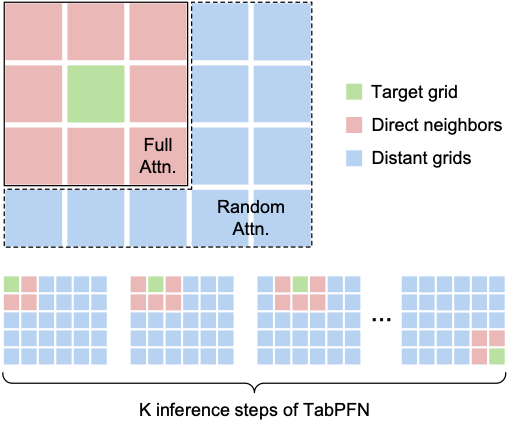

# TabPFN-GSA

Inspired by Tobler's law of Geography, **Geospatial Sparse Attention (GSA)** adds a geospatial inductive bias to TabPFN's In-context Learning (ICL) inference:

_**Attention should be focused more on spatially nearby data points than on distant ones.**_

## What is TabPFN-GSA?

🌊 [**TabPFN**](https://www.nature.com/articles/s41586-024-08328-6) is a powerful tabular foundation model (TFM), and has shown strong performance against many traditional tabular models (e.g., XGBoost, CatBoost, etc.) through ICL.

🤔 However, when handling **geospatial tabular datasets**, coordinate features (e.g., Lat. & Lon.) are treated the same as other ordinary features. Therefore, underlying spatial structures may not be fully exploited, and large contexts can make inference less accurate and inefficient.

🏄🏻‍♂️ **TabPFN-GSA** introduces a simple geospatial inductive bias. For each prediction location, it gives more context capacity to nearby samples, and only samples a small subset of distant samples.



* ### Incorporating a geospatial inductive bias to TabPFN

GSA follows a simple workflow:

1. Split the study area into `K = N x N` grids using spatial coordinates.
2. For each to-be-predicted grid, collect training samples from its 3 x 3 neighboring grids.
3. Randomly include additional training samples from distant grids with rate `s`.
4. Run the TabPFN regressor on this localised geospatial training context.
5. Move to the next to-be-predicted grid.

This makes the ICL context more spatially relevant, and usually smaller, so the model can effectively deal with larger datasets!

* ### Hyperparameters

| Parameter | Meaning                                                                                                                     |
|-----------|-----------------------------------------------------------------------------------------------------------------------------|
| `K` | Total number of grids. Currently, it must be a square number because `K = N x N`. Larger `K` means finer spatial locality. |
| `s` | Distant sampling rate. `0` means nearby only; larger values add more distant samples.                                       |


## Usage

* ### Installation

Download the project:

```bash
git clone https://github.com/ruid7181/TabPFN-GSA.git
cd TabPFN-GSA
```

For default model (TabPFN running in your local environment):

```bash
pip install -e .
```

For development and tests:

```bash
pip install -e .[dev]
```

* ### Interface and parameters

```python
from tabpfn_gsa import GSAModel, tune_gsa
```

Core parameters:

| Parameter | Description                                                                |
|-----------|----------------------------------------------------------------------------|
| `spa_cols` | Two spatial coordinate columns, for example `["coord_x", "coord_y"]`.      |
| `x_cols` | Non-spatial feature columns. If omitted, all non-spatial columns are used. |
| `K` | Total number of grids. It must be a square number because `K = N x N`.     |
| `s` | Distant sampling rate.                                                     |
| `random_state` | Random seed for reproducible GSA sampling.                                 |
| `device` | Local TabPFN device: `"auto"`, `"cuda"`, `"mps"`, or `"cpu"`.              |
| `verbose` | Print runtime information when fitting.                                    |
| `model_kwargs` | Optional advanced settings. Most users can leave it empty.                 |

* ### Inference

```python
from tabpfn_gsa import GSAModel

model = GSAModel(
    spa_cols=["coord_x", "coord_y"],
    x_cols=["x1", "x2"],
    K=64,
    s=0.1,
    random_state=0,
    verbose=True,
    model_kwargs={"ignore_pretraining_limits": True},
)

model.fit(train_df[["x1", "x2", "coord_x", "coord_y"]], train_df["target"])
pred = model.predict(test_df[["x1", "x2", "coord_x", "coord_y"]])
```

By default, `GSAModel` uses **local TabPFN**. With `device="auto"`, the local device is selected as:

```text
cuda -> mps -> cpu
```

* ### Finding optimal hyperparameters

`tune_gsa` uses Optuna to search optimal `K` and `s`.

```python
from tabpfn_gsa import tune_gsa

result = tune_gsa(
    estimator=model,
    X=train_df[["x1", "x2", "coord_x", "coord_y"]],
    y=train_df["target"],
    K_values=[25, 64, 100],
    s_values=[0.0, 0.05, 0.1, 0.2],
    metric="mae",
    cv=3,
    n_trials=20,
)

print(result.best_params)
best_model = result.best_estimator
```

Supported metrics: `mae`, `mse`, `rmse`, `r2`.

* ### Use other ICL TFMs as inference model

The default model is local TabPFN. For any other ICL TFM or cloud service, install and configure that environment yourself, then pass its `fit` / `predict` logic through `model_kwargs`.

For example, [TabICL](https://github.com/soda-inria/tabicl) follows the sklearn `fit` / `predict` API, so it can be plugged in directly after TabICL is installed in your environment.

```python
from tabicl import TabICLRegressor

def fit_fn(X_train, y_train):
    model = TabICLRegressor()
    model.fit(X_train, y_train)
    return model

def predict_fn(fitted_model, X_test):
    return fitted_model.predict(X_test)

model = GSAModel(
    spa_cols=["coord_x", "coord_y"],
    x_cols=["x1", "x2"],
    K=64,
    s=0.1,
    model_kwargs={
        "fit_fn": fit_fn,
        "predict_fn": predict_fn,
    },
)
```

* ### Prediction with uncertainty

```python
result = model.predict_with_uncertainty(test_df[["x1", "x2", "coord_x", "coord_y"]])

pred = result.mean
uncertainty = result.std
diagnostics = result.diagnostics
```

`std` is the ensemble standard deviation across repeated GSA local sampling.
