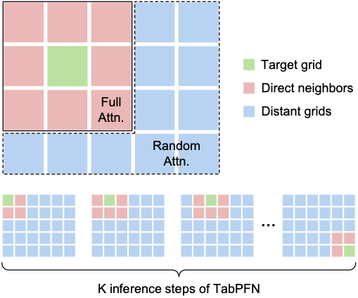

# TabPFN-GSA

Inspired by Tobler's law of Geography, **Geospatial Sparse Attention (GSA)** adds a geospatial inductive bias to TabPFN's In-context Learning (ICL) inference:

_**Attention should be focused more on spatially nearby data points than on distant ones.**_

## What is TabPFN-GSA?

🌊 [**TabPFN**](https://www.nature.com/articles/s41586-024-08328-6) is a powerful tabular foundation model (TFM), and has shown strong performance against many traditional tabular models (e.g., XGBoost, CatBoost, etc.) through ICL.

🤔 However, when handling **geospatial tabular datasets**, coordinate features (e.g., Lat. & Lon.) are treated the same as other ordinary features. Therefore, underlying spatial structures may not be fully exploited, and large contexts can make inference less accurate and inefficient.

🏄🏻‍♂️ **TabPFN-GSA** introduces a simple geospatial inductive bias. For each prediction location, it gives more context capacity to nearby samples, and only samples a small subset of distant samples.

**GSA also works with other ICL models.** Local TabPFN is the default; pass another model's methods through `model_kwargs`. [See TabICL and other interfaces below.](#use-other-icl-models)



### Incorporating a geospatial inductive bias to TabPFN

GSA follows a simple workflow:

1. Split the study area into `K = N x N` grids using spatial coordinates.
2. For each to-be-predicted grid, perform the following steps:
   * **a.** Collect training samples from its 3 x 3 neighboring grids.
   * **b.** Randomly include additional training samples from distant grids with rate `s`.
   * **c.** Run the TabPFN regressor on this localised geospatial training context.

This makes the ICL context more spatially relevant, and usually smaller, so the model can effectively deal with larger datasets!

### Hyperparameters

| Parameter | Meaning                                                                                                                     |
|-----------|-----------------------------------------------------------------------------------------------------------------------------|
| `K` | Total number of grids. Currently, it must be a square number because `K = N x N`. Larger `K` means finer spatial locality. |
| `s` | Distant sampling rate. `0` means nearby only; larger values add more distant samples (a small minimum is kept when `s > 0`). |


## Usage

[Local TabPFN](#local-tabpfn-default) is the default. Use the same interface for [TabICL](#local-tabicl) or [TabPFN Cloud](#cloud-tabpfn-client).

### Installation

Install GSA with local TabPFN:

```bash
git clone https://github.com/ruid7181/TabPFN-GSA.git
cd TabPFN-GSA
pip install -e .
```

Other models and cloud clients require their own installation and credentials. The base installation always includes local TabPFN.

<details>
<summary><strong>Interface and parameters</strong></summary>

| Parameter | Description                                                                |
|-----------|----------------------------------------------------------------------------|
| `spa_cols` | Two spatial coordinate columns, for example `["coord_x", "coord_y"]`.      |
| `spa_bounds` | Optional fixed spatial bounds, for example `{"coord_x": (0, 1), "coord_y": (0, 1)}`. If omitted, bounds are learned from training coordinates. |
| `x_cols` | Non-spatial feature columns. If omitted, all non-spatial columns are used. |
| `K` | Total grid cells, a square number. Default: `64`. |
| `s` | Distant sampling rate. Default: `0.1`. |
| `random_state` | GSA sampling seed, also passed to default local TabPFN. Default: `0`. |
| `device` | Default local TabPFN only: `"auto"`, `"cuda"`, `"mps"`, or `"cpu"`. Configure other models on their own objects. |
| `verbose` | Print runtime information when fitting.                                    |
| `model_kwargs` | Local TabPFN constructor options, or custom `fit_fn` / `predict_fn` as shown below. |

For development and tests: `pip install -e '.[dev]'`.

</details>

### Prepare data

Define your pandas data once, then choose one model example below.

```python
from tabpfn_gsa import GSAModel

cols = ["x1", "x2", "coord_x", "coord_y"]
X_train, y_train = train_df[cols], train_df["target"]
X_test = test_df[cols]
```

### Local TabPFN (default)

```python
model = GSAModel(
    spa_cols=["coord_x", "coord_y"],
    K=64,
    s=0.1,
    random_state=0,
    verbose=True,
)

model.fit(X_train, y_train)
pred = model.predict(X_test)
```

Inference runs locally with `cuda -> mps -> cpu` selected automatically. First use may download [TabPFN weights](https://github.com/PriorLabs/TabPFN); your dataset is not sent to the cloud API. `verbose=True` prints the package version and device.

<details>
<summary><strong>Input requirements and reproducibility</strong></summary>

- Keep the target out of `X`. Coordinates and targets must be numeric and finite.
- `fit` stores data; `predict` fits local contexts, each subject to the model's memory and sample limits.
- If `s=0` leaves an empty neighborhood, increase `s` or reduce `K`.
- A fixed seed gives each grid the same sampled context across batches. Record model/checkpoint versions and hardware for reproducibility.

</details>

## Use other ICL models

For sklearn-compatible models, pass `fit` and `predict` from the **same instance**. Configure its device, checkpoint and seed on that model. GSA independently controls spatial sampling and creates a fresh model for each context.

### Local TabICL

Install [TabICL](https://github.com/soda-inria/tabicl) in the same Python environment:

```bash
pip install tabicl
```

```python
from tabicl import TabICLRegressor

tabicl = TabICLRegressor(random_state=0)
model = GSAModel(
    spa_cols=["coord_x", "coord_y"],
    model_kwargs={
        "fit_fn": tabicl.fit,
        "predict_fn": tabicl.predict,
    },
)

model.fit(X_train, y_train)
pred = model.predict(X_test)
```

### Cloud TabPFN Client

Install the [official cloud client](https://github.com/PriorLabs/tabpfn-client):

```bash
pip install --upgrade tabpfn-client
```

Create a token in your [Prior Labs account](https://platform.priorlabs.ai/account/api-keys) and enter it at the prompt. No local GPU is needed.

```python
from getpass import getpass
from tabpfn_client import TabPFNRegressor, set_access_token

set_access_token(getpass("TabPFN API token: "))

cloud = TabPFNRegressor(random_state=0)
model = GSAModel(
    spa_cols=["coord_x", "coord_y"],
    verbose=True,
    model_kwargs={
        "fit_fn": cloud.fit,
        "predict_fn": cloud.predict,
        "sends_data_to_remote": True,
    },
)

model.fit(X_train, y_train)
pred = model.predict(X_test)
```

**Cloud uploads sampled training data, targets and query features, including coordinates.** Grids, repeated sampling and tuning generate multiple requests; check your service quota. `sends_data_to_remote` labels this in runtime information; it does not select the service. For unattended runs, use `TABPFN_TOKEN` instead of the prompt ([authentication guide](https://github.com/PriorLabs/tabpfn-client#authentication)).

<details>
<summary><strong>Local LimiX 2M / 16M and custom functions</strong></summary>

For a different API, `fit_fn(X_train, y_train)` returns a fresh model or context, and `predict_fn(state, X_test)` returns one value per row (array or PyTorch tensor). Inputs are pandas objects.

For [LimiX](https://github.com/limix-ldm-ai/LimiX), install its environment and download a 2M or 16M checkpoint first. Run below from the LimiX repository, with GSA installed in the same environment. Replace the checkpoint path.

```python
import torch
from inference.predictor import LimiXPredictor

predictor = LimiXPredictor(
    device=torch.device("cuda"),
    model_path="/path/to/LimiX-2M.ckpt",  # Or your LimiX-16M checkpoint.
    inference_config="config/reg_default_noretrieval.json",
    use_data_cache=False,
    seed=0,
)

def fit_fn(X_train, y_train):
    return X_train.to_numpy(), y_train.to_numpy()

def predict_fn(context, X_test):
    X_train, y_train = context
    return predictor.predict(
        X_train, y_train, X_test.to_numpy(), task_type="Regression"
    )

model = GSAModel(
    spa_cols=["coord_x", "coord_y"],
    model_kwargs={"fit_fn": fit_fn, "predict_fn": predict_fn},
)

model.fit(X_train, y_train)
pred = model.predict(X_test)
```

Weights are loaded once. `use_data_cache=False` avoids stale grid contexts; `task_type` belongs in `predict`. Custom services use the same functions, with `sends_data_to_remote=True`.

</details>

## Tuning and uncertainty

<details>
<summary><strong>Find optimal K and s with Optuna</strong></summary>

`tune_gsa` uses Optuna to search optimal `K` and `s`.

```python
from tabpfn_gsa import tune_gsa

result = tune_gsa(
    estimator=model,
    X=X_train,
    y=y_train,
    K_values=[25, 64, 100],
    s_values=[0.0, 0.05, 0.1, 0.2],
    metric="mae",
    cv=3,
    n_trials=20,
)

print(result.best_params)
best_model = result.best_estimator
```

Supported metrics: `mae`, `mse`, `rmse`, `r2`.
Combinations that leave a validation grid without training samples are skipped. If none succeeds, try smaller `K_values` or positive `s_values`.

</details>

<details>
<summary><strong>Prediction with uncertainty</strong></summary>

```python
result = model.predict_with_uncertainty(X_test)

pred = result.mean
uncertainty = result.std
diagnostics = result.diagnostics
```

`std` is the ensemble standard deviation across repeated GSA local sampling, not a calibrated confidence interval. Diagnostics report context sizes and the number of local models fitted.

</details>

## Citation

<details>
<summary><strong>BibTeX citation</strong></summary>

```bibtex
@article{deng2026foundation,
  title={Do foundation models work for geospatial tabular data? An investigation of TabPFN and a proposed enhancement based on geospatial sparse attention},
  author={Deng, Rui and Li, Ziqi and Wang, Mingshu},
  journal={International Journal of Geographical Information Science},
  pages={1--38},
  year={2026},
  publisher={Taylor \& Francis}
}
```

</details>
